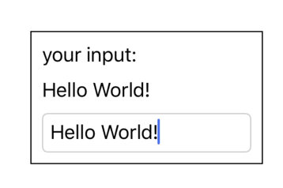
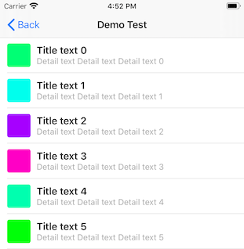

#  ZKit

## Demos

### Building Text Input Views and Binding Values



Passing `$text` into a `UITextField`, will auto assign to the label which observes the `text` value

```swift
    @State var text: String = "abc"

    override func viewDidLoad() {
        super.viewDidLoad()

        self.view.arrangeViews {
            UIView() {
                UIStackView(axis: .vertical, spacing: 10) {
                    UILabel().text("your input:")
                    UILabel().text(self.$text)
                    UITextField().text(self.$text).borderStyle(.roundedRect)
                }
                .padding(top: 10, leading: 10, bottom: 10, trailing: 10)
            }
            .borderWidth(1)
            .borderColor(.black)
            .alignment([.top, .centerX])
            .frame(width: 200)
            .padding(top: 160)
        }
        // Do any additional setup after loading the view.
    }
```

### Static List Using UIScrollView and UIStackView



Using `UIScrollView`, `UIStackView`, `for..in..` ...

```swift
self.view.arrangeViews {
    UIScrollView(.vertical) {
        for row in 0..<10 {
            UIView {
                UIStackView(axis: .horizontal, alignment: .center, spacing: 10) {
                    UIView()
                        .backgroundColor(UIColor(hue: CGFloat.random(in: 0...1), saturation: 1, brightness: 1, alpha: 1))
                        .cornerRadius(4)
                        .frame(width: 40, height: 40)
                    
                    UIStackView(axis: .vertical, alignment: .leading) {
                        UILabel().text("Title text \(row)")
                            .textColor(.label)
                            .font(.systemFont(ofSize: 17, weight: .semibold))
                        UILabel().text("Detail text Detail text Detail text \(row)")
                            .textColor(.lightGray)
                            .font(.systemFont(ofSize: 14, weight: .regular))
                    }
                }
                .frame(alignment: [.leading, .centerY])
                .margin(leading: 12)
                
                UIView()
                    .backgroundColor(.lightGray)
                    .frame(height: 0.5, alignment: [.leading, .bottom, .trailing])
                    .margin(leading: 12)
            }.frame(height: 60)
            
        }
    }
    .frame(alignment: .allEdges)
    .bounce(.vertical)
}

```

